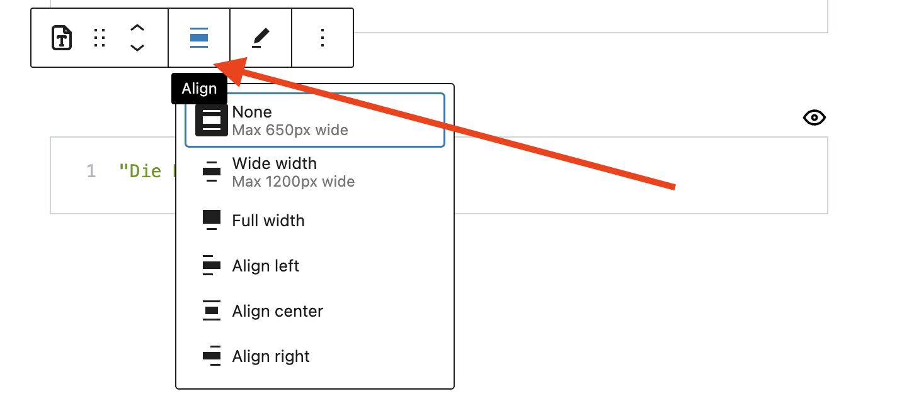

inseri core provides interactive and executable blocks. The blocks have names, which are integrated with the [WordPress List View](https://wordpress.org/documentation/article/list-view/){:target="\_blank"}, and are not isolated but they can receive input from and give output to compatible blocks.

If you want to see them in practice please see the [inseri core blocks](https://inseri.swiss/showcase/#core-blocks){:target="\_blank"} on inseri.swiss.

## Use cases

- Interactive online tool via **interactive online components** with all inseri blocks, e.g. [Plotly Chart](./plotly.md){:target="\_blank"}, [Dropdown](./dropdown.md){:target="\_blank"}
- Data reuse and integration of: **local user data** with the [Media Collection](./mediaCollection.md){:target="\_blank"} and [Local File Import](./localFileImport.md){:target="\_blank"} blocks, and **data interfaces** with [Zenodo Repository](./zenodo.md){:target="\_blank"} and [Web API](./webApi.md){:target="\_blank"} blocks
- Data analysis and simulation via **compute interfaces** with [Python Code](./python.md){:target="\_blank"}, [R Code](./rCode.md){:target="\_blank"}, [JavaScript Code](./javascript.md){:target="\_blank"}, [Web API](./webApi.md){:target="\_blank"} blocks

## Features

- [Open and Citable](../features/open_citable.md){:target="\_blank"} via the [Export block](../blocks/export.md){:target="\_blank"}
- [Publicly Editable](../features/publicly_editable.md){:target="\_blank"} to allow the visitors to change the content of given blocks
- [Invisible blocks](../features/hide_invisible_blocks.md){:target="\_blank"} to hide from the visitors given blocks
- [Share State](../features/share_state.md) to share the changes or the selection with other visitors via the [Share block](../blocks/share.md){:target="\_blank"}

## Edit the Source

You can edit the source of blocks by clicking on the edit icon.

<figure markdown>
{width="500"}
<figcaption>Edit icon</figcaption>
</figure>

## Change the Alignment

You can change the alignment or the width of a block by clicking on the Align icon and selecting the desired option.

<figure markdown>
{width="500"}
<figcaption>Align icon</figcaption>
</figure>
