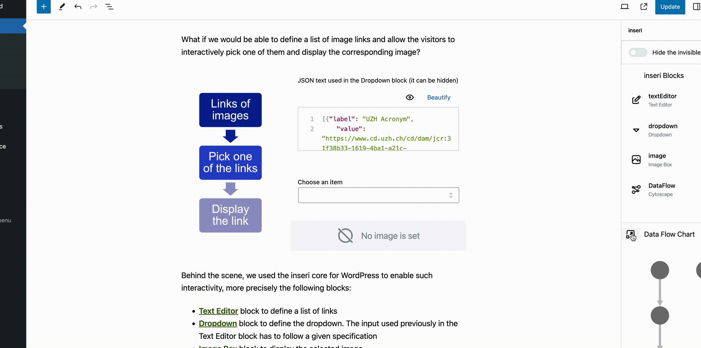

# inseri Data Flow

**inseri Data Flow** is available in the side panel near the configuration panel and provides a overview of the inseri blocks available in a given page or post and the dependencies between the blocks via a corresponding directed acyclic graph (DAG).

<figure markdown>
{width="700"}
  <figcaption> Data Flow: (i) open the side panel "inseri Data Flow" close to the configuration panel, (ii) select a block name in the Blocks are or a node in the Chart section. </figcaption>
</figure>

The Blocks section provides all inseri compatible blocks, and the Charts section provides an overview where the nodes are represented by nodes and the edges are the data. There are several actions that the use can perform:

- by selecting a block from the **Blocks** section, the corresponding node from the Chart section is selected (the color changes from grey to blue). Moreover, the block is highlighted also in the working area.
- by hovering any of the nodes from the **Chart** section, the corresponding block from the Blocks section is highlighted.
- by selecting any of the nodes from the **Chart** section, the corresponding block from the Blocks section is selected. Moreover, the block is highlighted also in the working area.

By clicking on the icon before Chart, a popup with the DAG is displayed where the name of the blocks is shown. By using "Show Details" (top right) a more complex diagram is displayed where one see exactly which data from a given block is used. You can control the font size (the value in top right is editable) and the position of the nodes.

<figure markdown>

  <figcaption> Data Flow Popup: click on the icon before Chart. </figcaption>
</figure>

To reproduce this example please follow [Hello World tutorial](../../tutorials/hello-world/){:target="\_blank"}.
