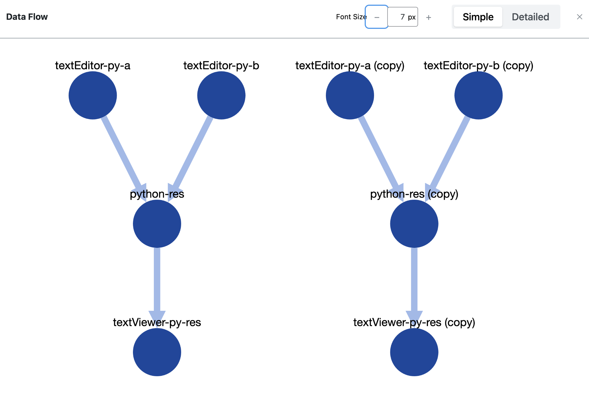

# Block Duplication

The inseri blocks are connected.
By **copy and pasting** or **duplicating** several blocks at once, the dependency between them is preserved such that they are easily reusable.

For example if you try in our [Playground](https://zi.uzh.ch/whp/science-it/inseri/playground/){:target="\_blank"} to Copy and Paste all blocks from [Python Code Block using Pyodide](https://zi.uzh.ch/whp/science-it/inseri/2023/02/python-code-block-using-pyodide/){:target="\_blank"}, the corresponding Data Flow chart will look like below.

<figure markdown>
{width="700"}
</figure>
