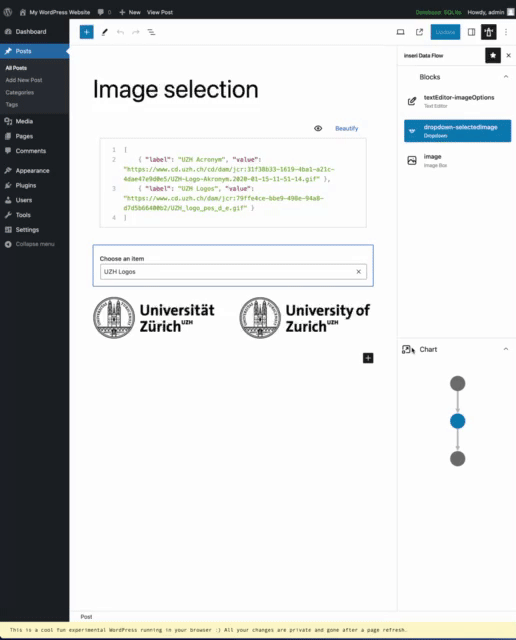

# Data Flow

**inseri Data Flow** is available in the [inseri Sidebar](../features/sidebar.md){:target="\_blank"} and provides an overview of the used inseri blocks and their dependencies via a corresponding directed acyclic graph (DAG).

<figure markdown>
{width="700"}
  <figcaption> Data Flow: (i) select "inseri" icon close to the Settings icon, (ii) select a block name in the "inseri Blocks" section or a node in the "Data Flow Chart" section </figcaption>
</figure>

The **inseri Blocks** section provides all inseri compatible blocks, and the **Data Flow Chart** section provides an overview as a directed acyclic graph (DAG) where the inseri blocks are represented as nodes and the edges correspond to the data. There are several actions that the user can perform:

- by hovering a block from the **inseri Blocks** section, the corresponding node from the "Data Flow Chart" section is highlighted (the margin changes from grey to dark grey).
- by selecting a block from the **inseri Blocks** section, the corresponding node from the "Data Flow Chart" section is selected (the color changes from grey to blue). Moreover, the block is highlighted also in the working area.
- by hovering a node from the **Data Flow Chart** section, the corresponding block from the "inseri Blocks" section is highlighted.
- by selecting a node from the **Data Flow Chart** section, the corresponding block from the "inseri Blocks" section is selected. Moreover, the block is highlighted also in the working area.

By clicking on the icon before "Data Flow Chart", a popup with the DAG is displayed where the name of the blocks is shown. By using "Show Details" (top right) a more complex diagram is displayed where one see exactly which data from a given block is used. You can control the font size (the value in top right is editable) and the position of the nodes.

<figure markdown>

  <figcaption> Data Flow Popup: click on the icon before "Data Flow Chart". </figcaption>
</figure>

A similar example can be obtain by following [Hello World tutorial](../tutorials/hello-world.md){:target="\_blank"}.
