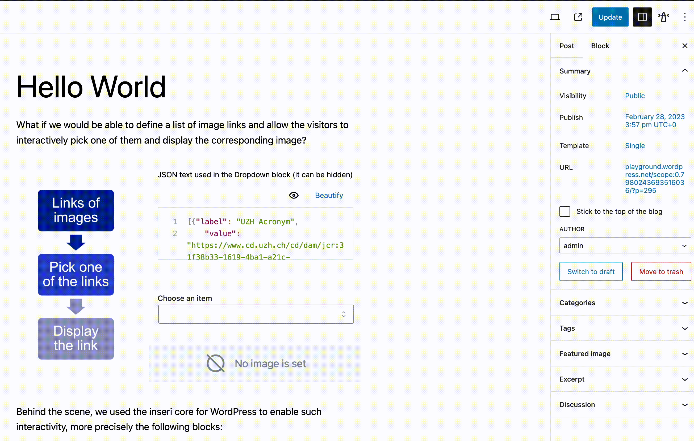

# Hide invisible blocks

This feature is available in the [inseri Sidebar](../features/sidebar.md){:target="\_blank"} and it hides all invisible blocks. Therefore it enables in edit mode an experience similar to the published mode, so as it is experienced by the guests.

inseri core provides the following blocks that can be hidden:

- [JavaScript Code block](../blocks/javascript.md){:target="\_blank"}
- [Media Collection block](../blocks/mediaCollection.md){:target="\_blank"} when only one file is desired
- [Python Code block](../blocks/python.md){:target="\_blank"}
- [Text Editor block](../blocks/textEditor.md){:target="\_blank"}
- [Web API block](../blocks/webApi.md){:target="\_blank"}
- [Zenodo Repository block](../blocks/zenodo.md){:target="\_blank"} when only one file is desired

As a concrete example, please see below how to hide the Text Editor block from the [Hello World](https://inseri.swiss/2023/02/hello-world/){:target="\_blank"}.

<figure markdown>

  <figcaption> Hide the text editor and the invisible blocks </figcaption>
</figure>
