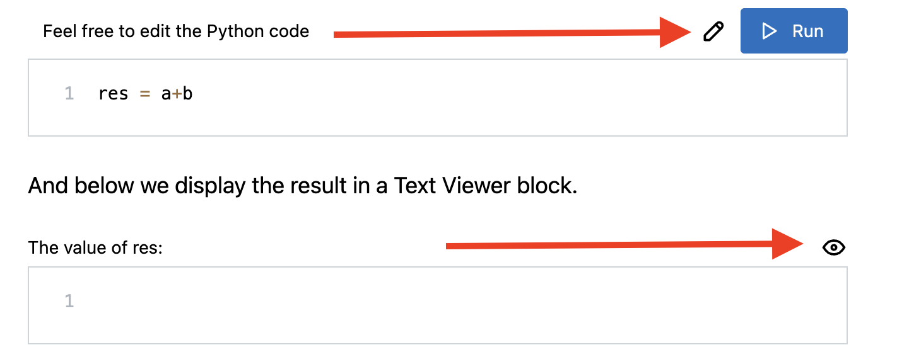

# Publicly Editable

This feature allows the visitors to edit the text content. The page author can disable it, so the content becomes read-only.

inseri core provides the following blocks that can be public editable:

- [JavaScript Code block](../blocks/javascript.md){:target="\_blank"}
- [Python Code block](../blocks/python.md){:target="\_blank"}
- [R Code block](../blocks/rCode.md){:target="\_blank"}
- [Text Editor block](../blocks/textEditor.md){:target="\_blank"}

<figure markdown>
{width="700"}
  <figcaption> Editable and read-only behavior is marked in the top right corner of the block </figcaption>
</figure>

As a concrete example, please see the [Python Code Block using Pyodide](https://zi.whp.uzh.ch/whp/science-it/inseri.swiss/2023/02/python-code-block-using-pyodide/){:target="\_blank"}.
