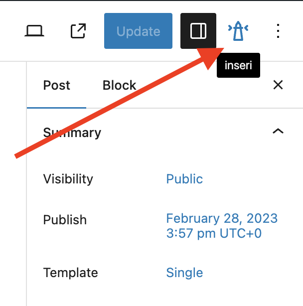
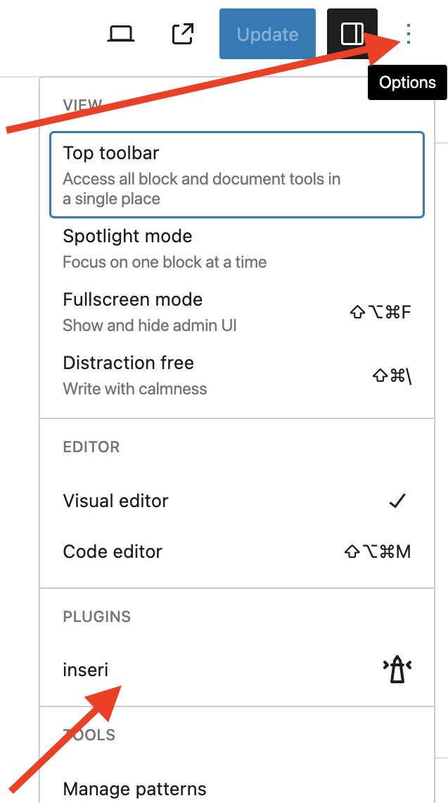
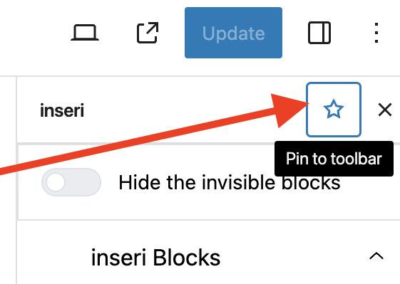

# inseri Sidebar Plugin

**inseri sidebar Plugin** (icon) is available in the upper-right corner and provides several inseri features.

<figure markdown>
{width="300"}
  <figcaption> open "inseri plugin" close to the Settings icon</figcaption>
</figure>

If the icon is not visible (unpinned), you can enable it via the options menu (see below).

<figure markdown>
{width="300"}
  <figcaption> enable inseri sidebar: (i) click on Options, (ii) click on inseri </figcaption>
</figure>

If you want to have it permanent in the toolbar, please pin it (see below).

<figure markdown>
{width="300"}
  <figcaption> Pin inseri plugin to the toolbar </figcaption>
</figure>
