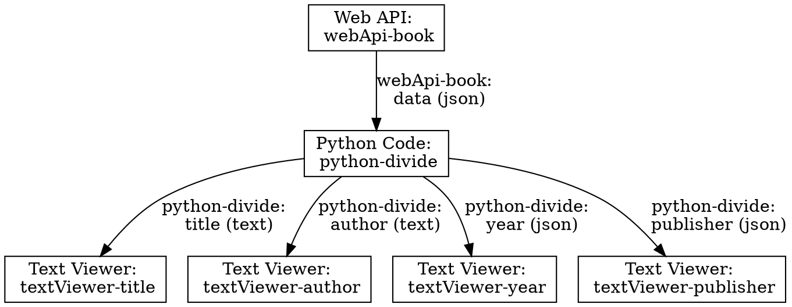

# Data mapping with Python

This tutorial will give a simple example how you can split complex data coming from a block (e.g. the web API block) into simpler structures, using the python block.
For this we have to join a couple of inseri blocks.

If you have no experience with inseri, please start with our [Hello World](./hello-world.md).

## Step 1: Create a new post

On your inseri instance or in the [playground](https://playground.inseri.swiss){:target="\_blank"} (remember, your changes will not be saved there), add a new post and give it a title.
In this example, we call the post "Data mapping with Python". You can type this at "Add title...".

## Step 2: Add a Web API block

Add an inseri Web API block by clicking the `+` below the title.
Select "Browse all" and look for "Web API" in the category _inseri_.

Enter the following URL in the corresponding field:

```
https://raw.githubusercontent.com/inseri-swiss/inseri-core-wp/main/docs/assets/book_metadata.json
```

Choose the Content Type "JSON" because that is what will be read by the dropdown that we are going to add later.

Now, give your Web API block a meaningful name.
For this, open the configuration panel on the right and enter "webApi-book" under _block name_.
Do not check the option "call automatically". For testing the request you should click on "Configure the settings", and click on "TRY REQUEST".

<figure markdown>

  <figcaption>Step 2: Click on "Configure the settings"</figcaption>
</figure>

<figure markdown>

  <figcaption>Step 2: Click on "TRY REQUEST" to test the request of the Web API block</figcaption>
</figure>

It should give the following content:

```json
{
	"title": "Die Physiker",
	"author": "Friedrich Dürrenmatt",
	"publisher": {
		"name": "Arche",
		"place": "Zürich"
	},
	"year": 1962
}
```

## Step 3: Add a Python block

Add a "Python Code" block the same way you added the web API block.

Once you have the block in your post, select "Write Code". This way you can add the code directly in this block.

First, set the _block name_ to `python-divide` available in the additional parameters.

Copy this snippet into the Python code editor:

```python
title = data["title"]
author = data["author"]
year = data["year"]
publisher = data["publisher"]
```

Obviously, this is not yet complete because `data` is not defined anywhere in the code.

## Step 4: Open the extended view for the Python block

Under "Inputs from Blocks", enter the variable name `data` and accept it with selecting the `+`.
You can now select `webApi-book: data` to connect this block to the web API block.

Now, you can set several output channels.
As with the input, enter a variable name from the script into the textbox and accept with `+`.
For `title` and `author` set the content type to "Text".
For `year` use the content type "JSON" as there is no specific type for numbers.
`publisher` is a complex structure that also gets the "JSON" type.

The extended view of the Python block should now look like this:

<figure markdown>

<figcaption>Step 4: Python block in extended view</figcaption>
</figure>

Make sure that the block is set to execute automatically.

!!! note

    You can hide the Python block if you want (the setting is above the execute automatically).

<figure markdown>
{width="300"}
<figcaption>Step 4: Execute automatically setting of the Python block</figcaption>
</figure>

## Step 5: Add text viewers

Now, add four text viewers.
Set their inputs to `python-divide: author`, `python-divide: year`, `python-divide: title`, `python-divide: publisher`, respectively.

!!! note

    You can edit the source of the Text Viewer block by clicking on the edit icon. This can be used for other inseri core blocks as well.

<figure markdown>
{width="500"}
<figcaption>Step 5: You can edit the source used by the Text Viewer block</figcaption>
</figure>
## Step 6: Save and publish

You can save and publish your post like any WordPress post.

Once published, the four text blocks will show their content after you press "Call Web API".

If you change the web-API block to execute automatically, the content will appear immediately.

## Overview

The following graph shows how the blocks are connected:


