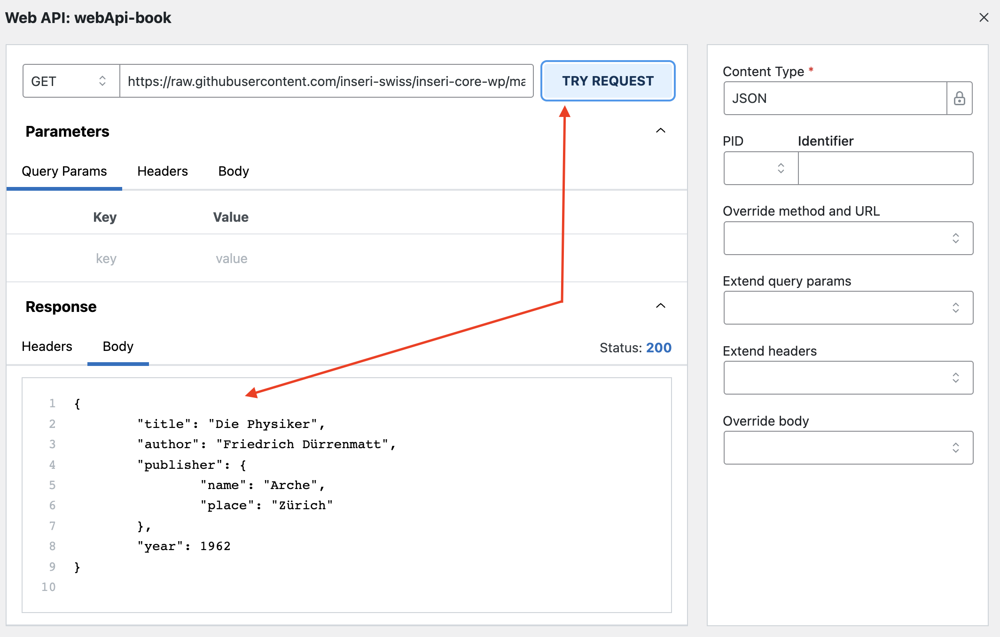
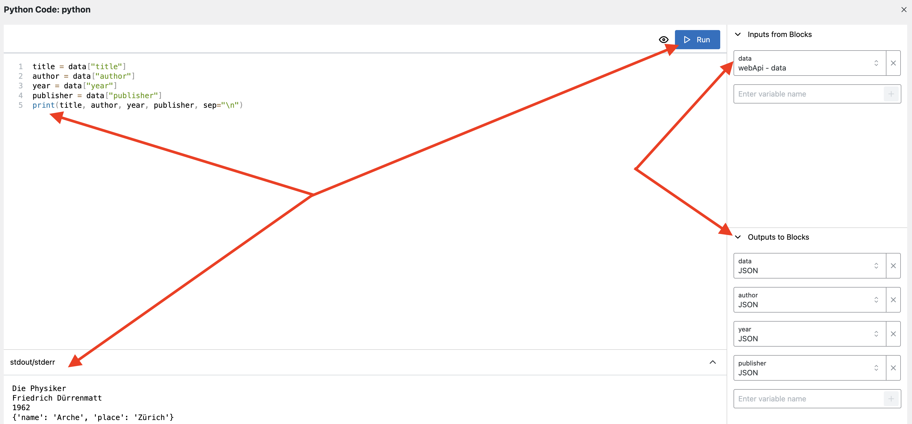
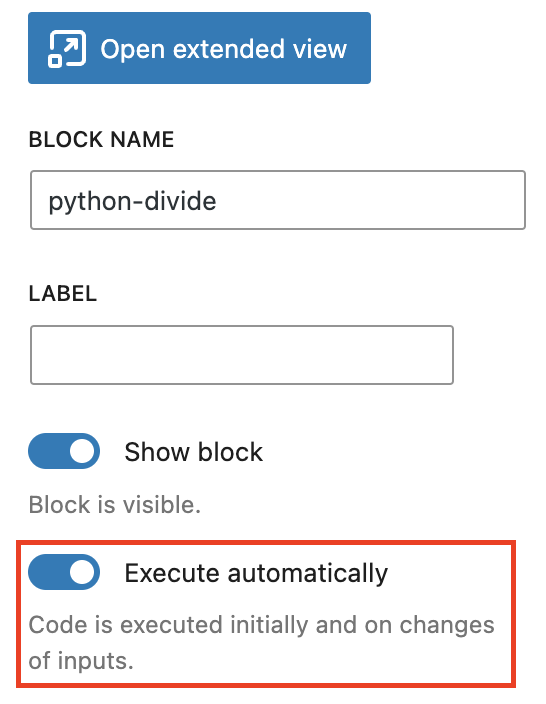
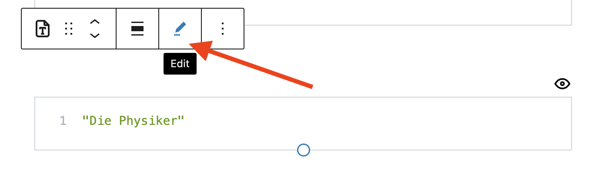

# Data Mapping with Python

This tutorial will give a simple example how you can split complex data coming from a block (e.g. the Web API block) into simpler structures, using the Python Code block.
For this we have to join a couple of inseri blocks.

If you have no experience with inseri, please start with our [Hello World](./hello_world.md).

For the final experience, please [click here](https://inseri.swiss/2023/03/data-mapping-with-python/){:target="\_blank"}.

## Step 1: Create a new post

On your inseri instance or in the [inseri Playground](https://playground.inseri.swiss){:target="\_blank"} (remember, your changes will not be saved there), add a new post and give it a title.
In this example, we call the post "Data Mapping with Python". You can type this at "Add title...".

## Step 2: Add the Web API block

1. Add the "Web API" block (like in the Step 2.1. from [Hello World](./hello_world.md)).
2. Enter the following URL in the corresponding field.
   ```
   https://raw.githubusercontent.com/inseri-swiss/inseri-core-wp/main/docs/assets/book_metadata.json
   ```
3. Choose "JSON" as Content Type because the Web API will fetch a JSON file.
4. Click "Finish".
5. Give the web API block the simple name "webApi" (like in Step 2.3. from [Hello World](./hello_world.md)).
6. Disable Call automatically (the setting is the below "BLOCK NAME"). In order to fetch the data, you have to click on the button "Call Web API".
7. For testing the request you should click on "Configure the settings" (in the sidebar above the "BLOCK NAME" above), and click on "TRY REQUEST" (see the picture below).
8. Close the view.

<figure markdown>

  <figcaption>Step 2: Click on "TRY REQUEST" to test the request of the Web API block</figcaption>
</figure>

It should give the following content:

```json
{
	"title": "Die Physiker",
	"author": "Friedrich Dürrenmatt",
	"publisher": {
		"name": "Arche",
		"place": "Zürich"
	},
	"year": 1962
}
```

## Step 3: Add the Python Code block

1. Add the "Python Code" block.
2. Select "Write Code". This way you can add the code directly in this block.
3. Give the Python Code block the simple name "python"
4. Copy the following snippet into the Python code editor:

   ```python
   title = data["title"]
   author = data["author"]
   year = data["year"]
   publisher = data["publisher"]
   ```

Obviously, this is not yet complete because `data` is not defined anywhere in the code.

## Step 4: Open the extended view of the Python Code block

<figure markdown>

<figcaption>Step 4: Python block in extended view</figcaption>
</figure>

1. To open the extended view you should click on "Open extended view" (in the sidebar above the "BLOCK NAME").
2. Under "Inputs from Blocks", enter the variable name `data` and accept it with selecting the `+`.
   You can now select `webApi - data` to connect this block to the web API block.
3. Define the outputs under "Output to Blocks".
   As with the input, enter a variable name from the script into the textbox and accept with `+`.
   For `title`, `author`, `year`, and `publisher` set the content type to "JSON".
4. Add a `print` statement (see below an example) to check whether the output variables have the desired value. Once everything looks as expected, remove or comment out the print statement. The extended view of the Python block should now look like the picture above.
   ```python
   print(title, author, year, publisher, sep="\n")
   ```
5. Comment out the `print` statement.
6. Close the extended view.
7. Make sure that the block is set to execute automatically (see the picture below).

!!! note

    You can hide the Python block if you want (the setting is above the execute automatically option).

<figure markdown>
{width="300"}
<figcaption>Step 4: Execute automatically setting of the Python block</figcaption>
</figure>

!!! warning

    After adding the outputs please "Save Draft" in top right, "View Preview" in bottom left, and "Edit Post" in the top toolbar to continue editing. This is needed to have access to all outputs of the Python Code block. Otherwise the last output will not be available.

## Step 5: Add the Text Viewer blocks

Now, add four Text Viewer blocks.
Set their inputs, i.e., the block source, to `python - author`, `python - year`, `python - title`, `python - publisher`, respectively.

!!! note

    You can edit the source of the Text Viewer block by clicking on the edit icon. This can be used for other inseri core blocks as well.

<figure markdown>
{width="500"}
<figcaption>Step 5: You can edit the source used by the Text Viewer block</figcaption>
</figure>

## Step 6: Save and publish

You can save and publish your post like any WordPress post.

Once published, the four text blocks will show their content after you press "Call Web API".

If you change the web-API block to execute automatically, the content will appear immediately.

## Overview

The Data Flow Chart provides a nice overview. You can see it also at the bottom of the [Data Mapping with Python](https://inseri.swiss/2023/03/data-mapping-with-python/){:target="\_blank"}.
