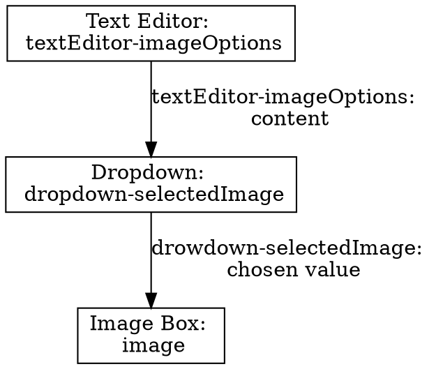

# Hello world

This tutorial will give a simple example how you can display different images depending on user selection.
For this we have to join a couple of inseri blocks.

You can check out the result of this tutorial on [inseri.swiss](https://inseri.swiss/2023/02/hello-world/).

## Step 1: Create a new post

On your inseri instance or in the [playground](https://inseri.swiss/playground/) (remember, your changes will not be saved there), add a new post (see the figure below) and give it a title.
In this example, we call the post "Image selection". You can type this at "Add title...".

<figure markdown>

  <figcaption>Step 1: Adding a new post in WordPress: (i) hover on mouse pointer over New and next, (ii) click on Post (or click directly on New)</figcaption>
</figure>

## Step 2: Text editor for the options

Add an inseri text editor by clicking the `+` below the title.
Select "Browse all" and look for "Text Editor" in the category _inseri_.

<figure markdown>

  <figcaption>Step 2: Adding a new block in WordPress: (i) click on "+" and next, (ii) click on Browse All</figcaption>
</figure>

Choose the format "JSON" because that is what will be read by the dropdown that we are going to add later.

Now, give your text editor a meaningful name.
For this, open the configuration panel on the right and enter "textEditor-imageOptions" under _block name_.

<figure markdown>

  <figcaption>Step 2: Edit the block name: (i) open the configuration panel, (ii) enter the desired name under "BLOCK NAME"</figcaption>
</figure>

## Step 3: Add options to the text editor

Copy this snippet into the text editor:

```json
[
	{ "label": "UZH Acronym", "value": "https://www.cd.uzh.ch/cd/dam/jcr:31f38b33-1619-4ba1-a21c-4dae47e9d0e5/UZH-Logo-Akronym.2020-01-15-11-51-14.gif" },
	{ "label": "UZH Logos", "value": "https://www.cd.uzh.ch/dam/jcr:79ffe4ce-bbe9-498e-94a8-d7d5b66400b2/UZH_logo_pos_d_e.gif" }
]
```

It contains two options with a label each.

## Step 4: Add a dropdown

Add a "Dropdown" from the category _inseri_ like you added the text editor before.

In the dropdown block you can now select the block source with the name "textEditor-imageOptions: content".

Like you did with the text editor, give the dropdown block a more meaningful name "dropdown-selectedImage".

## Step 5: Add an image viewer

Add the block "Image Box" from the category _inseri_ to your post.

Set the block source to the option "dropdown-selectedImage: chosen value".

Give the image box block the name "image".

## Step 6: Save, preview and publish

You can save and publish your post like any WordPress post. In case you use the playground you cannot publish it, but only preview it.

<figure markdown>

  <figcaption>Step 6: Save, preview and publish</figcaption>
</figure>

Once published (or in preview), you will see the text editor with the content as described above and a dropdown.
The image will load after selecting it from the dropdown.

## Overview

The following graph shows how the blocks are connected:


