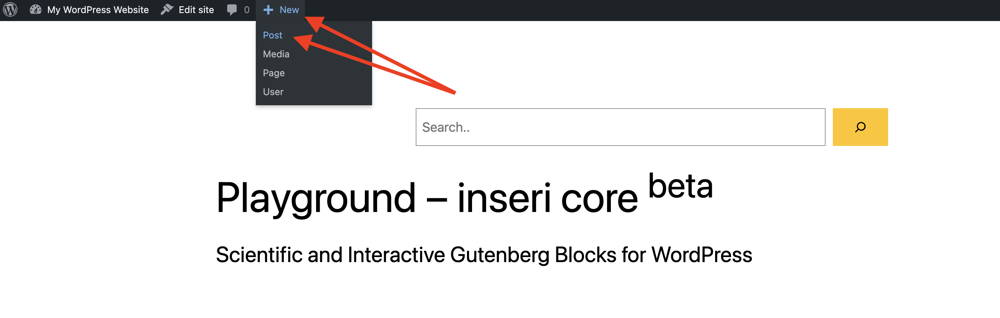
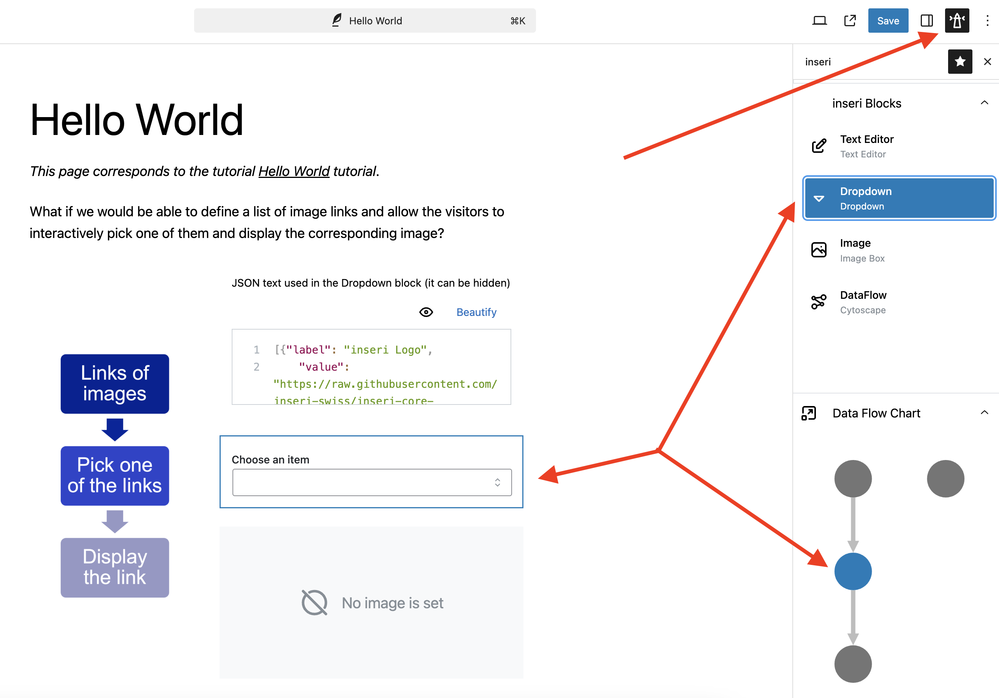

# Hello World

This tutorial allows you to chain multiple inseri blocks, with the specific example focusing on:

- Adding predefined images in dropdown menu
- Allowing the end user to select the images to display

For the final product, please [click here](https://inseri.swiss/2023/02/hello-world/){:target="\_blank"}.

## Step 0: Initialize your inseri instance

Open up [inseri Playground](https://playground.inseri.swiss){:target="\_blank"} or your WordPress instance with [`inseri-core`](https://wordpress.org/plugins/inseri-core/){:target="\_blank"} plugin installed.

Beware that changes done in the playground will not be saved.

## Step 1: Create a new post

Add a new post with the title "Image Selection", as presented in the figure below.

<figure markdown>
{width="700"}
  <figcaption>Step 1: Adding a new post in WordPress: (i) hover on mouse pointer over New and next, (ii) click on Post (or click directly on New)</figcaption>
</figure>

## Step 2: Add the Text Editor block

<figure markdown>
{width="700"}
<figcaption>Step 2: Adding a new block in WordPress by typing the forward-slash "/" and the block name (see the left side) or using the "+" icon and searching the block name (see the right side). </figcaption>
</figure>

1. Add the Text Editor block by using the [slash command](https://wordpress.org/documentation/article/adding-a-new-block/#slash-command){:target="\_blank"}, i.e., typing "/text editor" in the area "Type / to choose a block". Alternatively, you can use the [Block inserter](https://wordpress.org/documentation/article/adding-a-new-block/#what-is-the-inserter){:target="\_blank"}, i.e., the "+" icon below the title, and type "text editor" in the Search area.
2. Choose the format "JSON".
3. Next, rename your Text Editor block. For this, open the settings sidebar on the right and enter simply "textEditor" under "BLOCK NAME".

<figure markdown>
{width="900"}
  <figcaption>Step 2: Edit the block name: (i) open the settings sidebar, (ii) enter the desired name under "BLOCK NAME"</figcaption>
</figure>

!!! note

    You can hide the text editor block if you want (the setting is below the "BLOCK NAME, and is called "Show block" that by default is enabled).

## Step 3: Add dropdown and image information to the text editor

1. Now, copy the following snippet into the text editor. This will add two options ("UZH Acronym" and "UZH Logos") to the dropdown (see the "label" values below). Moreover the "value" values will be used to fetch the image and display it in Step 5.

```json
[
	{ "label": "UZH Acronym", "value": "https://www.cd.uzh.ch/cd/dam/jcr:31f38b33-1619-4ba1-a21c-4dae47e9d0e5/UZH-Logo-Akronym.2020-01-15-11-51-14.gif" },
	{ "label": "UZH Logos", "value": "https://www.cd.uzh.ch/dam/jcr:79ffe4ce-bbe9-498e-94a8-d7d5b66400b2/UZH_logo_pos_d_e.gif" }
]
```

## Step 4: Add the Dropdown block

1. Add the "Dropdown" block (like in Step 2.1.).
2. Select the block source with the name "textEditor - content".
3. Give the Dropdown block a simple name "dropdown" (like in Step 2.3.).
4. Choose a value (e.g., "UZH Logos").

!!! note

    You can edit the text "Choose an item" by using the "LABEL" area below the "BLOCK NAME".

## Step 5: Add the Image Box block

1.  Add the "Image Box" block (like in Step 2.1.).
2.  Select the block source with the name "dropdown - chosen value".

    !!! warning

        If you cannot see the block source, make sure that you did Step 4.4.

3.  Give the Image Box block the name (like in Step 2.3.).

## Step 6: Data Flow

The [Data Flow](../features/dataFlow.md){:target="\_blank"} provides an overview of the inseri blocks and the dependency between them. The data flow corresponding to this tutorial should be similar to the one below.

<figure markdown>
{width="700"}
  <figcaption>Step 6: Data Flow: (i) select "inseri" close to the Settings icon, (ii) select a block name in the "inseri Blocks" section or a node in the "Data Flow Chart" section. </figcaption>
</figure>

## Step 7: Save and publish

For the final step, you should save your post and publish it (The "Save draft" and "Publish" buttons are in the top right close to the Settings icon).

Once published, you can view the post and you will see the text editor with the snippet (step 3) and a dropdown (step 4),
where the corresponding image will load after the selection.

## Overview

The Data Flow Chart (see Step 6) provides a nice overview. You can see it also at the bottom of the [Hello World](https://inseri.swiss/2023/02/hello-world/){:target="\_blank"}.
