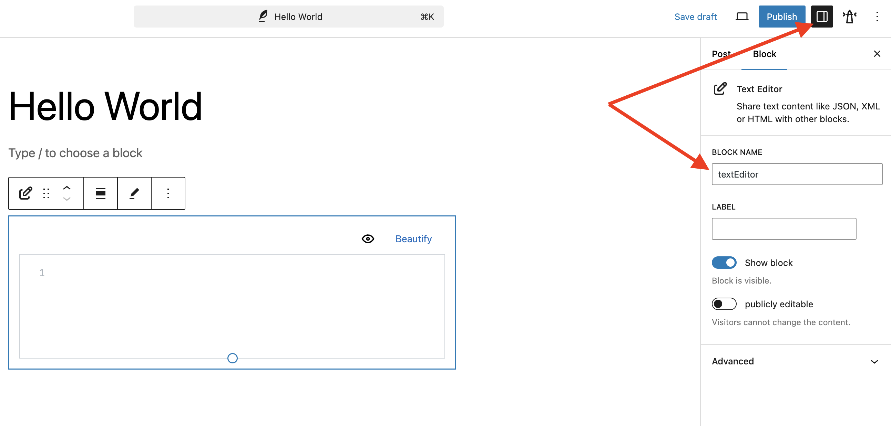

# Hello world

This tutorial allows you to chain multiple inseri blocks, with the specific example focusing on:

- Adding predefined images in dropdown menu
- Allowing the end user to select the images to display

For the final product, please [click here](https://inseri.swiss/2023/02/hello-world/){:target="\_blank"}.

## Step 0: Initialize your inseri instance

Open up [playground](https://playground.inseri.swiss){:target="\_blank"} or your WordPress instance with `inseri-core` installed.

Beware that changes done in the playground will not be saved.

## Step 1: Create a new post

Add a new post with the title "Image Selection", as presented in the figure below.

<figure markdown>
{width="700"}
  <figcaption>Step 1: Adding a new post in WordPress: (i) hover on mouse pointer over New and next, (ii) click on Post (or click directly on New)</figcaption>
</figure>

## Step 2: Add an inseri text editor block

Add an inseri text editor by clicking the `+` below the title.
Select "Browse all" and look for "Text Editor" block under the top section _inseri_.

<figure markdown>
{width="700"}
  <figcaption>Step 2: Adding a new block in WordPress: (i) click on "+" and next, (ii) click on Browse All</figcaption>
</figure>

<figure markdown>
{width="700"}
  <figcaption>Step 2: "Text editor" block category "inseri"</figcaption>
</figure>

To chain more inseri blocks in this example (text editor block to dropdown menu block), please choose the format "JSON".

<figure markdown>
{width="500"}
  <figcaption>Step 2: Set the text viewer to "JSON"</figcaption>
</figure>

Next, give your text editor a meaningful name.
For this, open the configuration panel on the right and enter "textEditor-imageOptions" under _block name_.

<figure markdown>
{width="700"}
  <figcaption>Step 2: Edit the block name: (i) open the configuration panel, (ii) enter the desired name under "BLOCK NAME"</figcaption>
</figure>

## Step 3: Add image information to the text editor

Now, copy the following snippet into the text editor.
This will add to image options (UZH logo and acronym) with a label.

```json
[
	{ "label": "UZH Acronym", "value": "https://www.cd.uzh.ch/cd/dam/jcr:31f38b33-1619-4ba1-a21c-4dae47e9d0e5/UZH-Logo-Akronym.2020-01-15-11-51-14.gif" },
	{ "label": "UZH Logos", "value": "https://www.cd.uzh.ch/dam/jcr:79ffe4ce-bbe9-498e-94a8-d7d5b66400b2/UZH_logo_pos_d_e.gif" }
]
```

## Step 4: Add a dropdown

Add a "Dropdown" from the category _inseri_ , as shown previously (step 2).

In the dropdown block you can now select the block source with the name "textEditor-imageOptions: content".

Similarly to the step 2 of the text editor, give the dropdown block a more meaningful name "dropdown-selectedImage".

## Step 5: Add an image viewer

To create a selection menu, add the block "Image Box" from the _inseri_ section.

Set the block source to the option "dropdown-selectedImage: chosen value".

Give the image box block the name "image".

## Step 6: Data Flow

The [Data Flow](../features/DataFlow.md){:target="\_blank"} provides an overview of the inseri blocks and the dependency between them.

<figure markdown>
{width="700"}
  <figcaption>Step 6: Data Flow: (i) open the side panel "inseri Data Flow" close to the configuration panel, (ii) select a block name in the Blocks are or a node in the Chart section </figcaption>
</figure>

## Step 7: Save and publish

For the final step, we should save our post and publish it.
Furthermore, in case of a full instance, you can now publish it.

<figure markdown>
{width="700"}
  <figcaption>Step 7: Save and publish</figcaption>
</figure>

Once published you will see the text editor with the snippet (step 3) and a dropdown (step 4),
where the corresponding image will load after its selection (step 5).

## Overview

The following graph shows how the blocks are connected:


